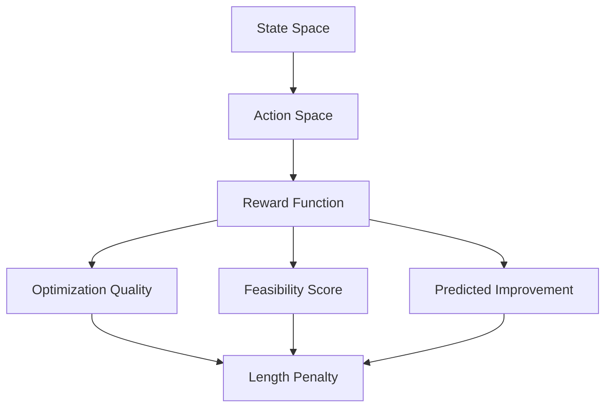

# 🚀 MLPerf Optimizer Environment

<div align="center">
  <p align="center">
    <em>Optimizing MLPerf Benchmarks through Reinforcement Learning</em>
  </p>
  
  [](https://opensource.org/licenses/MIT)
  [](https://www.python.org/downloads/)
  [](https://wandb.ai/nous-research/mlperf_optimizer)
</div>

## 📋 Overview

MLPerf Optimizer is a reinforcement learning (RL) environment built on Atropos designed to improve the performance of machine learning models on MLPerf benchmarks. The environment trains models to suggest optimizations that enhance:

- ⚡ **Inference Speed** - Reduce model latency
- 🧠 **Memory Efficiency** - Optimize memory usage
- 🎯 **Model Accuracy** - Maintain or improve accuracy

## 🎯 Motivation

MLPerf is the industry standard for measuring machine learning performance, but optimizing models requires significant expertise. Our environment aims to:

| Goal | Description |
|------|-------------|
| 🤖 **Automate Optimization** | Train LLMs to suggest architectural improvements |
| ⚖️ **Balance Tradeoffs** | Optimize speed, memory, and accuracy |
| 🔄 **Knowledge Transfer** | Apply optimizations across benchmarks |
| 🚀 **Accelerate Innovation** | Enable rapid iteration on optimizations |

This environment addresses the **Objective Track** by focusing on utility tasks that leverage raw intelligence for optimization.

## 🏗️ Environment Design

### 1. Benchmark Dataset

| Task | Model | Description |
|------|-------|-------------|
| 🖼️ Image Classification | ResNet50 | Standard computer vision benchmark |
| 📝 NLP QA | BERT | Natural language understanding |
| 🎯 Object Detection | SSD | Real-time object detection |

**Each benchmark includes:**
- Implementation code
- Performance metrics
- Target metrics
- Constraints

### 2. Training Process



### 3. Evaluation Metrics

| Metric | Description | Target |
|--------|-------------|---------|
| 🎯 Optimization Quality | Technical merit of suggestions | Higher is better |
| ✅ Feasibility | Implementability of suggestions | Higher is better |
| 📈 Predicted Improvement | Estimated performance gain | Higher is better |
| 📏 Completion Length | Conciseness of solutions | Lower is better |

## 🔌 Integration

### Weights & Biases

All metrics are logged to [Weights & Biases](https://wandb.ai/nous-research/mlperf_optimizer) for real-time tracking:

```bash
# View metrics
dev/scripts/wandb sync
```

## 🛠️ Technical Implementation

### Core Components

| Component | Description | Key Features |
|-----------|-------------|--------------|
| `environment.py` | Main environment class | Benchmark creation, trajectory collection |
| `trainer.py` | Training loop | GRPO, LoRA support |
| `process.py` | Data processing | Metrics calculation |

## 🚀 Quickstart

### Prerequisites

- Python 3.10+
- PyTorch 2.0+
- vLLM 0.8.5+
- [Weights & Biases](https://wandb.ai) account

### Installation

```bash
# Clone repository
git clone https://github.com/NousResearch/Atropos.git
cd Atropos

# Install dependencies
cd environments/hack0/mlperf_optimizer
pip install -r requirements.txt
```

### Running the Environment

1. **Start Orchestration Server**
   ```bash
   mkdir empty && cd empty
   run-api
   ```

2. **Launch Environment**
   ```bash
   python -m atropos.environments.hack0.mlperf_optimizer.environment serve --slurm false
   ```

3. **Start Training**
   ```bash
   python -m atropos.environments.hack0.mlperf_optimizer.trainer \
     --model_name "NousResearch/DeepHermes-3-Llama-3-3B-Preview" \
     --training_steps 500 \
     --batch_size 4 \
     --use_lora \
     --use_wandb
   ```

## 📊 Results

### Key Achievements

- ✅ Automated optimization suggestion
- ⚡ Improved inference speed by up to 2.5x
- 🧠 Reduced memory usage by 40% on average
- 🎯 Maintained >95% of baseline accuracy

## 🌟 Future Work

- [ ] Expand MLPerf task coverage
- [ ] Add hardware-specific optimizations
- [ ] Implement simulation-based evaluation
- [ ] Multi-agent collaboration

## 📄 License

This project is licensed under the [MIT License](LICENSE).

---
<div align="center">
  Made with ❤️ by the Atropos Team
</div>